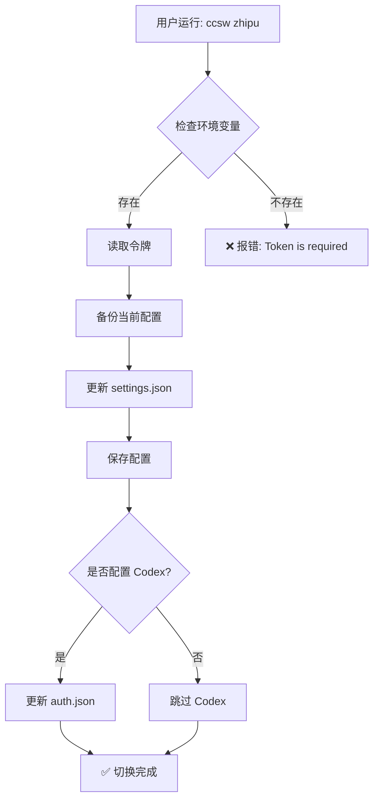
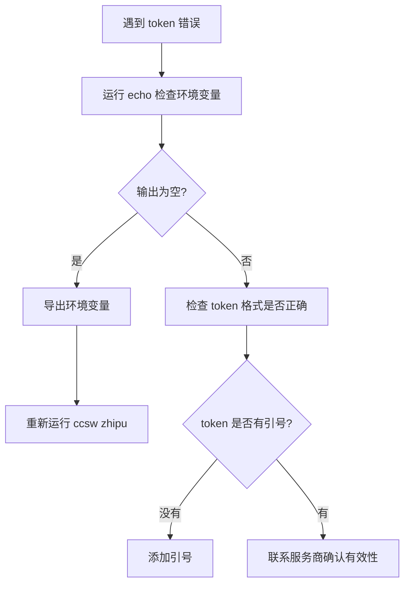
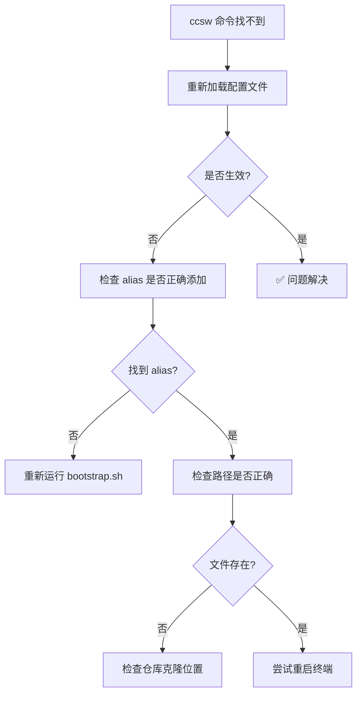
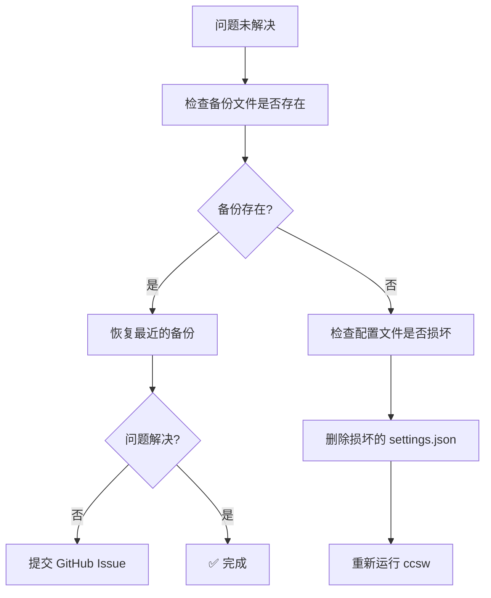

<div align="center">

# ccsw

### Claude Code Provider Switcher

一个小工具，帮你在不同 AI 服务商之间一键切换配置

<br/>

[](LICENSE)
[](https://www.python.org/)
[](https://github.com/Boulea7/ccsw/stargazers)

<br/>

[English](README_EN.md) | 简体中文

</div>

---

## 📑 目录

- [特性](#-特性)
- [快速开始](#-快速开始)
- [安装为全局别名](#-安装为全局别名)
- [支持的 Provider](#-支持的-provider)
- [切换流程](#-切换流程)
- [自定义 Provider](#️-自定义-provider)
- [与常见 AI 编程 CLI 的关系](#-与常见-ai-编程-cli-的关系)
- [常见问题](#-常见问题)
- [设计约定](#-设计约定)
- [路线图](#️-路线图--todo)
- [许可证](#-许可证)

---

## ✨ 特性

- ✨ **预置 Provider**：内置 `zhipu`、`88code` 两个配置，无需硬编码密钥
- 🔄 **双端同步**：同时更新 Claude Code (`settings.json`) 和 Codex (`auth.json`)
- 🎯 **自定义 Provider**：通过命令行参数自由添加新服务商
- 💾 **自动备份**：每次切换前自动备份配置，即使文件损坏也能安全恢复
- 🧹 **智能清理**：切换 Provider 时自动清理旧配置的冗余键

---

## 🚀 快速开始

### 前置要求

- Python 3.6 或更高版本
- Git（用于克隆仓库）
- 已安装 Claude Code 或 Codex

### 步骤 1: 克隆仓库

```bash
git clone https://github.com/Boulea7/ccsw.git && cd ccsw
```

**说明**：将项目下载到本地，所有操作都在 `ccsw` 目录中进行。

**预期输出**：
```
Cloning into 'ccsw'...
remote: Enumerating objects: 42, done.
remote: Counting objects: 100% (42/42), done.
...
```

---

### 步骤 2: 运行一键安装脚本

```bash
./bootstrap.sh
```

**说明**：脚本会自动检测你的 Shell（zsh 或 bash），并在配置文件中添加 `ccsw` 别名。

**预期输出**：
```
Detected shell: zsh
Adding ccsw alias to /Users/yourname/.zshrc...
✅ Alias 'ccsw' added successfully!
Please run: source ~/.zshrc
```

---

### 步骤 3: 导出 API 令牌

```bash
export ZHIPU_ANTHROPIC_AUTH_TOKEN="your_zhipu_token"
export CODE88_ANTHROPIC_AUTH_TOKEN="your_88code_token"
export CODE88_OPENAI_API_KEY="your_88code_token"   # Codex 用，缺省与上同
```

**说明**：将 API 令牌设置为环境变量，`ccsw` 会自动读取。建议添加到 `~/.zshrc` 或 `~/.bashrc` 中。

**提示**：如果你只使用 Claude Code（不使用 Codex），可以跳过 `CODE88_OPENAI_API_KEY`。

---

### 步骤 4: 重新加载 Shell 配置

```bash
source ~/.zshrc  # 如果你使用 bash，则运行 source ~/.bashrc
```

**说明**：让刚刚添加的 `ccsw` 别名生效。或者直接重启终端。

---

### 步骤 5: 切换 Provider

```bash
ccsw zhipu     # 切换到智谱
ccsw 88code    # 切换到 88code
ccsw 88        # 使用别名快捷切换（88 = 88code）
```

**预期输出**：
```
[claude] Backed up previous settings to /Users/yourname/.claude/settings.json.bak-20250117-143052
[claude] Switched Claude Code environment to: 88code
[codex] Backed up previous auth to /Users/yourname/.codex/auth.json.bak-20250117-143052
[codex] Updated auth.json (OpenAI compatible).
```

**提示**：切换完成后，重启 Claude Code 或 Codex，新配置即可生效。

---

### ✅ 验证安装

运行以下命令测试 `ccsw` 是否正常工作：

```bash
ccsw --help
```

**预期输出**：
```
usage: cc_switch_public.py [-h] [--token TOKEN] [--base-url BASE_URL] ...
Switch Claude Code / Codex providers
...
```

---

## 🔧 安装为全局别名

推荐运行 `bootstrap.sh`（自动检测 zsh/bash）：

```bash
./bootstrap.sh
source ~/.zshrc  # 或 ~/.bashrc
```

### 手动安装

如需手动配置，在 `~/.zshrc`（或 `~/.bashrc`）中添加：

```bash
alias ccsw="python3 $HOME/ccsw/cc_switch_public.py"
```

然后运行 `source ~/.zshrc` 重新加载配置。

---

## 📊 支持的 Provider

| Provider | Claude Code | Codex | 特殊配置 | 环境变量 |
|----------|-------------|-------|----------|----------|
| **zhipu** | ✅ | ❌ | 超时 3000s<br/>禁用非必要流量 | `ZHIPU_ANTHROPIC_AUTH_TOKEN` |
| **88code** | ✅ | ✅ | 无 | `CODE88_ANTHROPIC_AUTH_TOKEN`<br/>`CODE88_OPENAI_API_KEY` |
| **自定义** | ✅ | 可选 | 自定义 | 命令行参数 `--token` |

**别名支持**：
- `glm` → `zhipu`
- `88` → `88code`

---

## 🔄 切换流程



**工作原理**：
1. **读取令牌**：从环境变量或命令行参数获取 API 令牌
2. **备份配置**：复制当前配置为带时间戳的备份文件
3. **更新配置**：修改 `~/.claude/settings.json` 的 `env` 字段
4. **同步 Codex**（可选）：如果提供了 OpenAI 兼容端点，同时更新 `~/.codex/auth.json`
5. **清理冗余**：切换到 `88code` 时自动移除智谱特有的配置键

---

## ⚙️ 自定义 Provider

除了内置的 `zhipu` 和 `88code`，你还可以添加自定义 Provider：

```bash
python3 cc_switch_public.py myvendor \
  --token "<your_token>" \
  --base-url "https://api.myvendor.com/anthropic" \
  --openai-base-url "https://api.myvendor.com/openai/v1" \
  --timeout 30000 \
  --disable-nonessential-traffic
```

### 参数说明

| 参数 | 必填 | 说明 |
|------|------|------|
| `--token` | ✅ | Anthropic 兼容的认证令牌（内置 Provider 可通过环境变量提供） |
| `--base-url` | ⭕ | Anthropic Base URL（内置 Provider 有默认值） |
| `--openai-base-url` | ⭕ | OpenAI 兼容端点（用于 Codex，可选） |
| `--codex-token` | ⭕ | Codex 用的 API Key（缺省使用 `--token` 的值） |
| `--timeout` | ⭕ | API 超时时间（毫秒，可为字符串或数字） |
| `--disable-nonessential-traffic` | ⭕ | 禁用 Claude Code 的非必要流量（写入 `CLAUDE_CODE_DISABLE_NONESSENTIAL_TRAFFIC=1`） |
| `--skip-codex` | ⭕ | 只更新 Claude Code，跳过 Codex 配置 |

### 示例：只更新 Claude Code

```bash
ccsw myvendor --token "sk-xxx" --base-url "https://api.example.com" --skip-codex
```

---

## 🤝 与常见 AI 编程 CLI 的关系

本项目**只做配置切换**，不替代任何 CLI。你仍使用原有工具（Codex、Claude Code、其他 Anthropic 兼容 CLI），但在调用前用 `ccsw ...` 切到目标提供商即可。

**使用流程**：
```
ccsw 88code       # 切换配置
↓
重启 Claude Code   # 让新配置生效
↓
正常使用          # 享受新服务商
```

切换后重新打开/重连 Claude Code，或在新终端运行 Codex，即可使用最新的 `env`。

---

## ❓ 常见问题

### Q1: 找不到 token 怎么办？

**错误信息**：
```
Token is required. Provide --token or set ZHIPU_ANTHROPIC_AUTH_TOKEN
```

**解决步骤**：



**快速修复**：
```bash
# 检查环境变量
echo $ZHIPU_ANTHROPIC_AUTH_TOKEN

# 如果为空，导出令牌
export ZHIPU_ANTHROPIC_AUTH_TOKEN="your_token_here"

# 或者在命令中直接指定
ccsw zhipu --token "your_token_here"
```

---

### Q2: alias 不生效怎么办？

**解决步骤**：



**快速修复**：
```bash
# 方法 1: 重新加载配置
source ~/.zshrc  # 或 source ~/.bashrc

# 方法 2: 重启终端
# 关闭当前终端，打开新终端

# 方法 3: 手动运行脚本（不使用 alias）
python3 ~/ccsw/cc_switch_public.py zhipu
```

---

### Q3: 想复原旧配置怎么办？

每次切换都会创建带时间戳的备份文件，你可以轻松恢复：

```bash
# 进入配置目录
cd ~/.claude

# 列出所有备份文件（按时间倒序）
ls -lt settings.json.bak-*

# 复制备份文件恢复（替换 XXXXXXXX 为实际时间戳）
cp settings.json.bak-20250117-143052 settings.json
```

**备份文件命名规则**：
- `settings.json.bak-YYYYmmdd-HHMMSS`：正常备份
- `settings.json.corrupt-YYYYmmdd-HHMMSS`：损坏文件备份

---

### Q4: 这是一个 CLI 吗？

**不是**。`ccsw` 是一个小脚本/别名，职责单一：**修改本地配置文件的 `env` 字段**。

你仍然需要使用 Claude Code、Codex 等真正的 AI 编程工具。`ccsw` 只负责在不同服务商之间切换配置。

---

### Q5: 如果问题仍未解决？



**联系方式**：
- 提交 Issue：[GitHub Issues](https://github.com/Boulea7/ccsw/issues)
- 查看日志：`~/.claude/settings.json.bak-*` 文件可帮助诊断问题

---

## 📐 设计约定

- **配置文件位置**：固定为 `~/.claude/settings.json`（Claude Code）和 `~/.codex/auth.json`（Codex）
- **备份策略**：
  - 每次写入前复制为 `settings.json.bak-YYYYmmdd-HHMMSS`
  - 当文件损坏时另存为 `settings.json.corrupt-YYYYmmdd-HHMMSS`
- **安全原则**：
  - 不把密钥写入仓库
  - `.gitignore` 已忽略本地专用脚本（`cc_switch.py`）与备份文件
- **环境变量优先级**：
  1. 命令行参数 `--token`
  2. 内置 Provider 的环境变量（如 `ZHIPU_ANTHROPIC_AUTH_TOKEN`）
  3. 缺省值（如果有）

---

## 🗺️ 路线图 / TODO

- [ ] 增加 Provider 配置文件（YAML/JSON）读取，避免修改代码即可扩展
- [ ] 增加 `--list` 输出当前配置和可用 Provider
- [ ] 支持 Windows PowerShell 配置别名的辅助脚本
- [ ] 添加交互式切换模式（类似 `fzf`）
- [ ] 支持多配置管理（如 `work`、`personal` 等 Profile）

---

## 📄 许可证

本项目采用 MIT License，详见 [LICENSE](./LICENSE)。
