```mermaid
graph TD
    A[ccsw command not found] --> B[Reload config file]
    B --> C{Working?}
    C -->|No| D[Check if alias added correctly]
    D --> E{Found alias?}
    E -->|No| F[Re-run bootstrap.sh]
    E -->|Yes| G[Check path correctness]
    G --> H{File exists?}
    H -->|No| I[Check repo clone location]
    H -->|Yes| J[Try restarting terminal]
    C -->|Yes| K[✅ Problem solved]
```

<div align="center">

# ccsw

### Claude Code Provider Switcher

A lightweight tool to switch between different AI providers for Claude Code and Codex

<br/>

[](LICENSE)
[](https://www.python.org/)
[](https://github.com/Boulea7/ccsw/stargazers)

<br/>

English | [简体中文](README.md)

</div>

---

## 📑 Table of Contents

- [Features](#-features)
- [Quick Start](#-quick-start)
- [Global Alias Installation](#-global-alias-installation)
- [Supported Providers](#-supported-providers)
- [Switching Flow](#-switching-flow)
- [Custom Provider](#️-custom-provider)
- [Relationship with AI CLI Tools](#-relationship-with-ai-cli-tools)
- [FAQ](#-faq)
- [Design Conventions](#-design-conventions)
- [Roadmap](#️-roadmap--todo)
- [License](#-license)

---

## ✨ Features

- ✨ **Pre-configured Providers**: Built-in `zhipu` and `88code` configurations without hardcoded secrets
- 🔄 **Dual Sync**: Updates both Claude Code (`settings.json`) and Codex (`auth.json`) simultaneously
- 🎯 **Custom Provider**: Easily add new providers via command-line parameters
- 💾 **Auto Backup**: Automatically backs up configurations before switching, even recovers from corrupted files
- 🧹 **Smart Cleanup**: Automatically removes redundant configuration keys when switching providers

---

## 🚀 Quick Start

### Prerequisites

- Python 3.6 or higher
- Git (for cloning the repository)
- Claude Code or Codex installed

### Step 1: Clone Repository

```bash
git clone https://github.com/Boulea7/ccsw.git && cd ccsw
```

**Description**: Download the project to your local machine. All operations will be performed in the `ccsw` directory.

**Expected Output**:
```
Cloning into 'ccsw'...
remote: Enumerating objects: 42, done.
remote: Counting objects: 100% (42/42), done.
...
```

---

### Step 2: Run Bootstrap Script

```bash
./bootstrap.sh
```

**Description**: The script automatically detects your shell (zsh or bash) and adds the `ccsw` alias to your configuration file.

**Expected Output**:
```
Detected shell: zsh
Adding ccsw alias to /Users/yourname/.zshrc...
✅ Alias 'ccsw' added successfully!
Please run: source ~/.zshrc
```

---

### Step 3: Export API Tokens

```bash
export ZHIPU_ANTHROPIC_AUTH_TOKEN="your_zhipu_token"
export CODE88_ANTHROPIC_AUTH_TOKEN="your_88code_token"
export CODE88_OPENAI_API_KEY="your_88code_token"   # For Codex, defaults to above
```

**Description**: Set API tokens as environment variables. `ccsw` will automatically read them. It's recommended to add these to `~/.zshrc` or `~/.bashrc`.

**Tip**: If you only use Claude Code (not Codex), you can skip `CODE88_OPENAI_API_KEY`.

---

### Step 4: Reload Shell Configuration

```bash
source ~/.zshrc  # Or source ~/.bashrc if using bash
```

**Description**: Activate the newly added `ccsw` alias. Alternatively, restart your terminal.

---

### Step 5: Switch Provider

```bash
ccsw zhipu     # Switch to Zhipu
ccsw 88code    # Switch to 88code
ccsw 88        # Use alias shortcut (88 = 88code)
```

**Expected Output**:
```
[claude] Backed up previous settings to /Users/yourname/.claude/settings.json.bak-20250117-143052
[claude] Switched Claude Code environment to: 88code
[codex] Backed up previous auth to /Users/yourname/.codex/auth.json.bak-20250117-143052
[codex] Updated auth.json (OpenAI compatible).
```

**Tip**: After switching, restart Claude Code or Codex for the new configuration to take effect.

---

### ✅ Verify Installation

Run the following command to test if `ccsw` is working:

```bash
ccsw --help
```

**Expected Output**:
```
usage: cc_switch_public.py [-h] [--token TOKEN] [--base-url BASE_URL] ...
Switch Claude Code / Codex providers
...
```

---

## 🔧 Global Alias Installation

Recommended method using `bootstrap.sh` (auto-detects zsh/bash):

```bash
./bootstrap.sh
source ~/.zshrc  # Or ~/.bashrc
```

### Manual Installation

To configure manually, add to `~/.zshrc` (or `~/.bashrc`):

```bash
alias ccsw="python3 $HOME/ccsw/cc_switch_public.py"
```

Then run `source ~/.zshrc` to reload the configuration.

---

## 📊 Supported Providers

| Provider | Claude Code | Codex | Special Config | Environment Variable |
|----------|-------------|-------|----------------|----------------------|
| **zhipu** | ✅ | ❌ | 3000s timeout<br/>Disable non-essential traffic | `ZHIPU_ANTHROPIC_AUTH_TOKEN` |
| **88code** | ✅ | ✅ | None | `CODE88_ANTHROPIC_AUTH_TOKEN`<br/>`CODE88_OPENAI_API_KEY` |
| **Custom** | ✅ | Optional | Custom | CLI parameter `--token` |

**Alias Support**:
- `glm` → `zhipu`
- `88` → `88code`

---

## 🔄 Switching Flow

```mermaid
graph TD
    A[User runs: ccsw zhipu] --> B{Check env var}
    B -->|Exists| C[Read token]
    B -->|Not found| D[❌ Error: Token required]
    C --> E[Backup config]
    E --> F[Update settings.json]
    F --> G[Save config]
    G --> H{Configure Codex?}
    H -->|Yes| I[Update auth.json]
    H -->|No| J[Skip Codex]
    I --> K[✅ Switch complete]
    J --> K
```



**How It Works**:
1. **Read Token**: Obtain API token from environment variable or CLI parameter
2. **Backup Config**: Copy current config to a timestamped backup file
3. **Update Config**: Modify the `env` field in `~/.claude/settings.json`
4. **Sync Codex** (Optional): Update `~/.codex/auth.json` if OpenAI-compatible endpoint is provided
5. **Cleanup**: Automatically remove Zhipu-specific keys when switching to `88code`

---

## ⚙️ Custom Provider

Besides built-in `zhipu` and `88code`, you can add custom providers:

```bash
python3 cc_switch_public.py myvendor \
  --token "<your_token>" \
  --base-url "https://api.myvendor.com/anthropic" \
  --openai-base-url "https://api.myvendor.com/openai/v1" \
  --timeout 30000 \
  --disable-nonessential-traffic
```

### Parameter Reference

| Parameter | Required | Description |
|-----------|----------|-------------|
| `--token` | ✅ | Anthropic-compatible auth token (built-in providers can use env vars) |
| `--base-url` | ⭕ | Anthropic Base URL (built-in providers have defaults) |
| `--openai-base-url` | ⭕ | OpenAI-compatible endpoint (for Codex, optional) |
| `--codex-token` | ⭕ | API Key for Codex (defaults to `--token` value) |
| `--timeout` | ⭕ | API timeout in milliseconds (string or number) |
| `--disable-nonessential-traffic` | ⭕ | Disable non-essential traffic (sets `CLAUDE_CODE_DISABLE_NONESSENTIAL_TRAFFIC=1`) |
| `--skip-codex` | ⭕ | Only update Claude Code, skip Codex configuration |

### Example: Update Claude Code Only

```bash
ccsw myvendor --token "sk-xxx" --base-url "https://api.example.com" --skip-codex
```

---

## 🤝 Relationship with AI CLI Tools

This project **only handles configuration switching**, not replacing any CLI tools. You continue using your existing tools (Codex, Claude Code, other Anthropic-compatible CLIs), but switch providers before calling them with `ccsw ...`.

**Usage Flow**:
```
ccsw 88code        # Switch config
↓
Restart Claude Code # Activate new config
↓
Normal usage       # Enjoy new provider
```

After switching, restart/reconnect Claude Code or run Codex in a new terminal to use the latest `env`.

---

## ❓ FAQ

### Q1: Token Not Found

**Error Message**:
```
Token is required. Provide --token or set ZHIPU_ANTHROPIC_AUTH_TOKEN
```

**Solution**:


**Quick Fix**:
```bash
# Check environment variable
echo $ZHIPU_ANTHROPIC_AUTH_TOKEN

# If empty, export token
export ZHIPU_ANTHROPIC_AUTH_TOKEN="your_token_here"

# Or specify in command
ccsw zhipu --token "your_token_here"
```

---

### Q2: Alias Not Working

**Solution**:



**Quick Fix**:
```bash
# Method 1: Reload configuration
source ~/.zshrc  # Or source ~/.bashrc

# Method 2: Restart terminal
# Close current terminal, open new one

# Method 3: Run script manually (without alias)
python3 ~/ccsw/cc_switch_public.py zhipu
```

---

### Q3: How to Restore Old Configuration

Each switch creates a timestamped backup file for easy recovery:

```bash
# Navigate to config directory
cd ~/.claude

# List all backup files (reverse chronological)
ls -lt settings.json.bak-*

# Copy backup to restore (replace XXXXXXXX with actual timestamp)
cp settings.json.bak-20250117-143052 settings.json
```

**Backup File Naming**:
- `settings.json.bak-YYYYmmdd-HHMMSS`: Normal backup
- `settings.json.corrupt-YYYYmmdd-HHMMSS`: Corrupted file backup

---

### Q4: Is This a CLI Tool?

**No**. `ccsw` is a small script/alias with a single responsibility: **modify the `env` field in local configuration files**.

You still need to use real AI programming tools like Claude Code, Codex, etc. `ccsw` only handles switching configurations between different providers.

---

### Q5: Problem Still Not Resolved?


**Contact**:
- Submit Issue: [GitHub Issues](https://github.com/Boulea7/ccsw/issues)
- Check logs: `~/.claude/settings.json.bak-*` files can help diagnose issues

---

## 📐 Design Conventions

- **Config File Location**: Fixed at `~/.claude/settings.json` (Claude Code) and `~/.codex/auth.json` (Codex)
- **Backup Strategy**:
  - Copy to `settings.json.bak-YYYYmmdd-HHMMSS` before each write
  - Save as `settings.json.corrupt-YYYYmmdd-HHMMSS` when file is corrupted
- **Security Principles**:
  - No secrets in repository
  - `.gitignore` excludes local scripts (`cc_switch.py`) and backup files
- **Environment Variable Priority**:
  1. CLI parameter `--token`
  2. Built-in provider env vars (e.g., `ZHIPU_ANTHROPIC_AUTH_TOKEN`)
  3. Default values (if available)

---

## 🗺️ Roadmap / TODO

- [ ] Add provider config file (YAML/JSON) reading to extend without code modification
- [ ] Add `--list` to output current config and available providers
- [ ] Support Windows PowerShell alias configuration script
- [ ] Add interactive switching mode (like `fzf`)
- [ ] Support multi-configuration management (e.g., `work`, `personal` profiles)

---

## 📄 License

This project is licensed under the MIT License. See [LICENSE](./LICENSE) for details.
